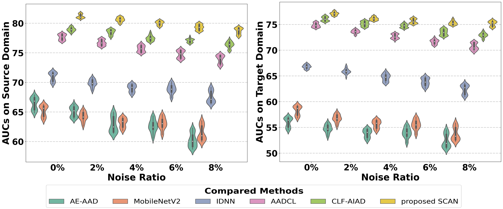

# SCAN: Selective Contrastive Learning Against Noisy Data for Acoustic Anomaly Detection

# 1. Robustness with Varying Noise Ratios

## 1.1 Comparison of Performance Trends with Varying Noise Ratios

## 1.2 Detailed Per-Machine Results under Highest 8% Noise

| Method | Source Domain |  |  |  |  |  | Target Domain |  |  |  |  |  |
| --- | --- | --- | --- | --- | --- | --- | --- | --- | --- | --- | --- | --- |
|  | **Fan** | **Gearbox** | **Slider** | **Valve** | **Bearing** | **Ave** | **Fan** | **Gearbox** | **Slider** | **Valve** | **Bearing** | **Ave** |
| AE-AAD | 62.48 | 65.61 | 70.27 | 48.99 | 53.76 | 60.222 | 50.8 | 57.63 | 49.05 | 54.14 | 54.32 | 53.19 |
| MobileNetV2 | 65.46 | 63.83 | 60.11 | 65.1 | 60.47 | 62.994 | 53.95 | 59.89 | 48.17 | 61.43 | 60.31 | 56.75 |
| IDNN | 64.91 | 64.6 | 70.58 | 71.63 | 72.21 | 68.786 | 60.95 | 61.87 | 66.01 | 66.94 | 58.68 | 62.89 |
| AADCL | 73.05 | 71.27 | 72.29 | 74.89 | 74.65 | 73.23 | 70.77 | 72.26 | 69.93 | 71.27 | 71.39 | 71.12 |
| CLF-AIAD | 78.65 | 76.91 | 76.12 | 72.42 | 75.99 | 76.018 | 71.88 | 75.36 | 70.09 | 71.71 | 73.96 | 72.6 |
| proposed SCAN-8% | 80.59 | 77.43 | 76.48 | 76.57 | 80.52 | 78.318 | 73.06 | 75.93 | 75.77 | 75.33 | 74.53 | 74.924 |
