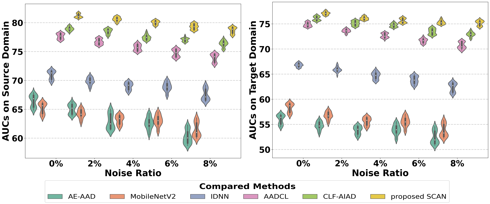
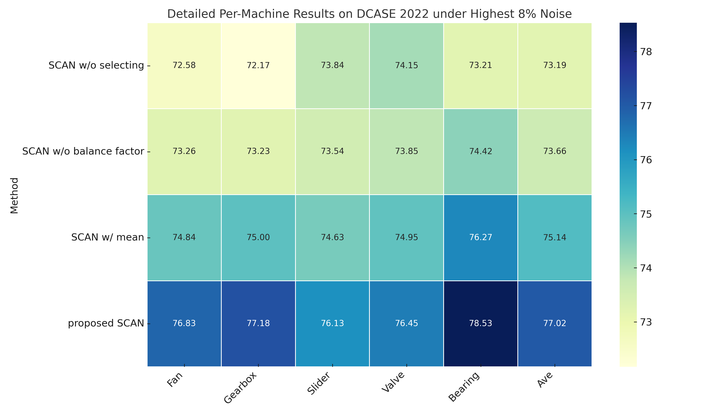
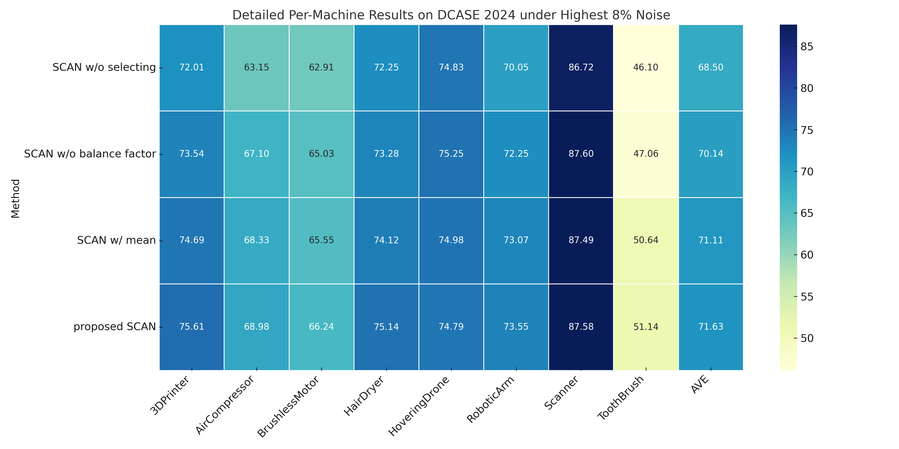

# SCAN: Selective Contrastive Learning Against Noisy Data for Acoustic Anomaly Detection

# 1. Robustness with Varying Noise Ratios

## 1.1 Comparison of Performance Trends with Varying Noise Ratios

The figure presents a comparison of performance trends on source and target domains for the proposed SCAN, baselines, and advanced methods with increasing noise ratios (0% to 8%).

## 1.2 Detailed Per-Machine Results under Highest 8% Noise

The figure below presents detailed AUC performance for each machine type under the highest noise ratio (8%), comparing baseline methods, advanced CL-based approaches, and our proposed SCAN.

## 1.3 Visualisation

### 1.3.1 Over different approaches

t-SNE visualisations of extracted features from the bearing test data under 8% label noise are presented to compare the representation quality of AE-AAD, MobileNetV2, AADCL, CLF-AIAD, and our proposed SCAN, as shown in the figures below.  The proposed SCAN produces more distinct features, indicating its superior ability to capture latent representations under noisy data conditions.

### 1.3.2 Over different Epochs

t-SNE visualizations of extracted features from the bearing test data under 8% label noise are presented for the proposed SCAN at 100, 200, 300, and 400 training epochs. As the number of training epochs increases, the feature clusters become progressively more structured and separated. At 400 epochs, SCAN shows the most distinct feature distribution, corresponding to its best performance.

# 2. Comparison to Top-performing Systems

In this Table, SCAN consistently outperforms both the baseline and top-performing systems across various noise levels, achieving higher AUC scores in DCASE2022. In DCASE2024, when the noise ratio exceeds 8%, the performance gap between SCAN and the top-1 system remains small, demonstrating its strong robustness even when trained on noisy data.

| Method | AE | top-1 | top-2 | top-3 | top-4 | top-5 | Scan-0% | Scan-1% | Scan-2% | Scan-3% | Scan-4% |
| --- | --- | --- | --- | --- | --- | --- | --- | --- | --- | --- | --- |
| DCASE 2023 | 61.5 | 77.13 | 74.87 | 73.72 | 69.7 | 68.22 | 79.78 | 78.56 | 78.22 | 77.86 | 77.02 |
| DCASE2024 | 60.6 | 73.98 | 72.81 | 69.04 | 61.35 | 61.09 | 74.53 | 74.11 | 73.52 | 72.98 | 71.63 |

# 3. Ablation Study

To evaluate the effectiveness of the proposed method, ablation experiments were conducted on three SCAN variants:

(1)**SCAN w/o selecting**, which removes the confident pair selection module;

(2)**SCAN w/o balance factor**, which applies the final threshold value from Eq. (5) at the beginning of training; and

(3)**SCAN w/ mean**, which uses the mean vector instead of the geometric median for Mahalanobis distance calculation.

First, SCAN w/o selecting experiences a sharp decline as noise increases, underscoring the importance of noise mitigation strategies. Second, SCAN without a balance factor further deteriorates under high noise conditions and across different datasets, emphasising the need for progressively increasing threshold confidence to enhance acoustic representation learning and model stability. Lastly, SCAN with mean underperforms the geometric median, which offers better robustness in real-world scenarios.

## 3.1 Comparison of Performance Trends with Varying Noise Ratios with SCAN’s variants

Comparison of performance trends on source and target domains for the proposed SCAN and its variations for increasing noise ratios (0% to 8%).

## 3.2 Detailed Per-Machine Results on DCASE2022/DCASE2024 under Highest 8% Noise

